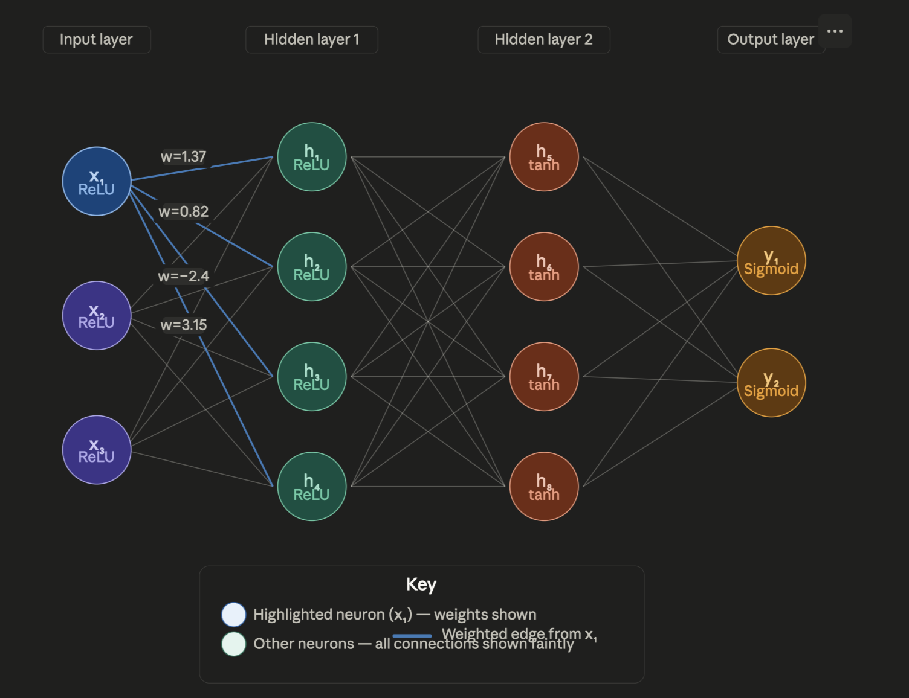

# learning_ai

For the skill section of my Silver DofE I want to learn about AI.
My goal with this project is to learn about what an AI is and how to build a basic AI. 

## Learning Plan
### Phase 1 — Foundations and intuition 

This phase has the goal of learning the basics and to have a proper understanding what a model is and why neural networks work the way they do.

### Phase 2 — Building neural networks from scratch 

Start to code a basic neural network

### Phase 3 — From neural network to GPT
Build a small GPT and use real LLMs through an API.

---

### Week 1: What AI actually is, and what an LLM actually is

Watched the first 3 lessons of [Microsoft’s Generative AI for Beginners](https://github.com/microsoft/generative-ai-for-beginners)

looked at the fundamentals of LLM with the goal of answering the following questions:

#### What is an LLM?

LLMs are a type of AI that is meant to use language like a human. 
This is done by predicting text based on probabilities.Text is split into tokens which help the LLM predict the next token (the process of tokenisation). The tokens are converted into integers to represent them before the LLM uses them. This is how the same prompt can give different responses.

#### What can a LLM do?

LLMs can complete text based tasks like answering questions or writing a short story. They tend to be better with tasks that don't require specific information like writing a short story or summarising text.

#### What can't a LLM do?

Because of pretraining LLMs can't be reliably correct so they can't always be used as a source of information. They are also unable to have emotions as they don't actually think like a human this also means that they can struggle with tasks that use human common sense. They also can't help with task that it has not been trained for as it is pretrained.

---

### Week 2: How a neural network represents knowledge

I watched ["But what is a neural network?"](https://youtu.be/aircAruvnKk?si=Ua-yuvyIjy_TXIwX) by 3blue1brown, I learned:

Neural networks are made of layers including an input, an output layer and hidden layers in between.

Each layer is made up of neurons that have a bias and an activation. The activation is determined by the activation of all the neurons of the previous layer.

The connection between each neuron have a weight. An activation is determined by the weighted sum(the weights being the weights of the connection) added to the bias, then put into a function(e.g. sigmoid) that results in a value between 0 and 1.

I also used the [TensorFlow Playground](https://playground.tensorflow.org) to get an idea of the effect of the weight, how many layers there are, how many neuron are on each layer and other parameters, on how effective the neural network is.

---

### Week 3: Gradient descent — the engine of learning

I watched  [Gradient descent, how neural networks learn](https://youtu.be/IHZwWFHWa-w?si=enMc157WJJ2l6_zv) by 3blue1brown, I learned:

To determine how bad the computer did the cost function is used.

This is determined by subtracting the expected activation from the actual activation, then squaring it (so that bigger errors have greater effect and so that sign don't have an effect) for each neuron on the output layer.

Then adding them up to get a single score (the lower, the better it did) can be written as 𝛴(a-e)^2.

The cost function uses lots of training data (a sample input and the expected output for that input) the cost is calculated for all the training data.

For a neural network to improve it needs to know how to improve not just how it did.

This is done using gradient descent, a process where it finds the local gradient and uses it to "move down hill" (reducing the cost) this means it will find the local minimum, but this may not be the best option. It will likely not change much from this local minimum as the adjustments will be too small so it will move one way, and then it will want to move back.

Due to it taking every weight and bias as an input there are many local minimums (each weight and bias add their own dimension to a graph that the gradient is from making it more complex) so it will often not be optimal.

---

### week 4/5 Backpropagation

I watched  [Backpropagation, intuitively](https://youtu.be/Ilg3gGewQ5U?si=HJbLsZmiyPSro92K) by 3blue1brown, I learned:

Backpropagation is the process of finding what change would decrease the cost for a specific neurone in the output layer across multiple tests (theoretically all examples should be used but it’s more effective to use random groups).

Then the same thing happens for all other neurones in the output layer.

Neurones that have a greater difference from expected output have a greater influence.

This is then repeated with the second to last layer going back until it has gone to the input layer.

The weight and bias are changed in a way to reduce the cost.

Backpropagation finds the gradient that is used in gradient descent and that determines the change that should be made to reduce the cost

Within the gradient the larger a value the grater the influence of that change on the cost (the sign(+/-) doesn’t matter in this case but it is used to determine what change is made)

A weight is more influential if the activation of the related neurone is greater and the activation of a neurone has more influence when the weight is greater (because each depends on the other in the chain rule.)

Each training example suggests to change each weight and bias differently, so for each weight and bias you average, then sum the change that each training example wishes to make for the weight or bias. This gives the gradient of the cost function.

It would take a long time for a computer to calculate the gradient using every training example. 

So randomise the list then split the list into groups usually in the hundreds, then it uses that to make a change then use the next list.

This means that it will not go as directly towards the local minimum but it will be much faster than using all the data each time. This is called stochastic gradient descent.

I also watched  [Backpropagation calculus](https://youtu.be/tIeHLnjs5U8?si=D1Rq2DKIROrE8rOE) by 3blue1brown, I learned:

You want to find the change in the cost divided by the  change in a weight (to find how big of an effect it has and if it should be increased or decreased). This can be written as  ∂C/∂w with w representing any weight and C representing the cost in this training example.

All the equations mentioned are chain rule expressions and their derivatives. These are used to find how much of an influence a change will have on the cost.

For the following example the assumption is that this neural network or the relative section only has one neurone per layer

For this example the weighted sum would be w x a(L-1) + b

This can be shown as: 
∂C/ ∂w=( ∂z/ ∂w)x( ∂a/ ∂z)x( ∂C/ ∂a)

Where: 
C=cost for this training example 
w= weight  
z= result of the weighted sum + bias 
a= activation of the neurone 
∂= delta (change in) 
y= expected result 
b= bias 
(L-1) means that it is referring to the respective thing on the previous layer

∂C / ∂a=2(a-y) (this is specifically the derivative of mean squared error. cost function)

∂a / ∂z=σ’(z) (this is specifically for the sigmoid function)

∂z / Δ∂=a(L-1) 
This means that the effect of the weight is affected by the activation to the neurone it is coming from (a(L-1)).

This means that  ∂C / ∂w = 2(a-y)σ’(z)a(L-1)

The actual cost would be the average across many training examples.

The equation for the bias is the same but the ∂w is replaced with  ∂b.

So the equation becomes: 
 ∂C/ ∂b=( ∂z/ ∂b)x( ∂a/ ∂z)x( ∂C/ ∂a)

And 
∂z/ ∂b=1

So 
∂C / ∂b=1x2(a-y)σ’(z)= 
∂C / ∂b=2(a-y)σ’(z)

The equation for the effect of the previous activation is the same but ∂w or ∂b becomes ∂a(L-1)

So the equation becomes 
∂C/ ∂a(L-1)=( ∂z/ ∂a(L-1))x( ∂a/ ∂z)x( ∂C/ ∂a)

And 
∂z/ ∂a(L-1)=w

So 
∂C/ ∂a(L-1)=w2(a-y)σ’(z)

When the neural network has multiple neurones per layer, a subscript is added to determine what neurone or weight is being referred to.

The weighted sum would be more complex for this example as there are more weights and activations. 

The equation for a specific connection between neurones will be the same, but with a subscript for every value, bar the cost, to show what it is referring to.

But the equation does change for the activation of a neurone on the layer (L-1) 
The equation would become (the sub scripts are not included): 
∂C/ ∂a(L-1)=Σ( ∂z/ ∂a(L-1))x( ∂a/ ∂z)x( ∂C/ ∂a)

Σ is the sum of j from 0 to n(L-1) which means it is the sum of its effect for each individual neurone of the previous  layer.

---

### week 6-8 micrograd

I watched  [The spelled-out intro to neural networks and backpropagation: building micrograd](https://youtu.be/VMj-3S1tku0?si=wIPkgGHAs6W8_SNn) by Andrej Karpathy

While watching the video I also wrote the program at the same time.

the program and a read me is in the [micrograd](micrograd) file.

---

### week 9-12 makemore

i watched the fist three part of makemore by andrej karpathy: [part1](https://youtu.be/PaCmpygFfXo?si=MAl2v7GycG8UnXps), [part2](https://youtu.be/TCH_1BHY58I?si=J4cgu8_aTS3Zht7q), [part3](https://youtu.be/P6sfmUTpUmc?si=MStETvCviYWd7YsM)

while watching the video i also wrote the program at the same time (like with micrograd)

the program the a read me is in the [makemore](makemore) file.

