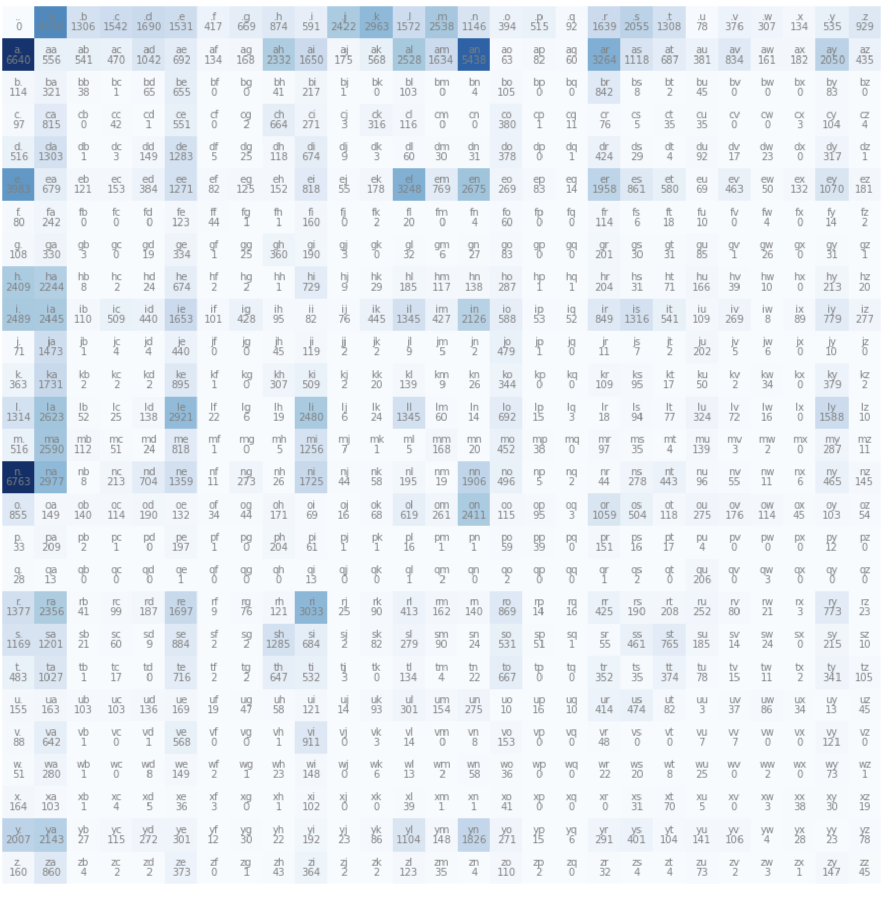
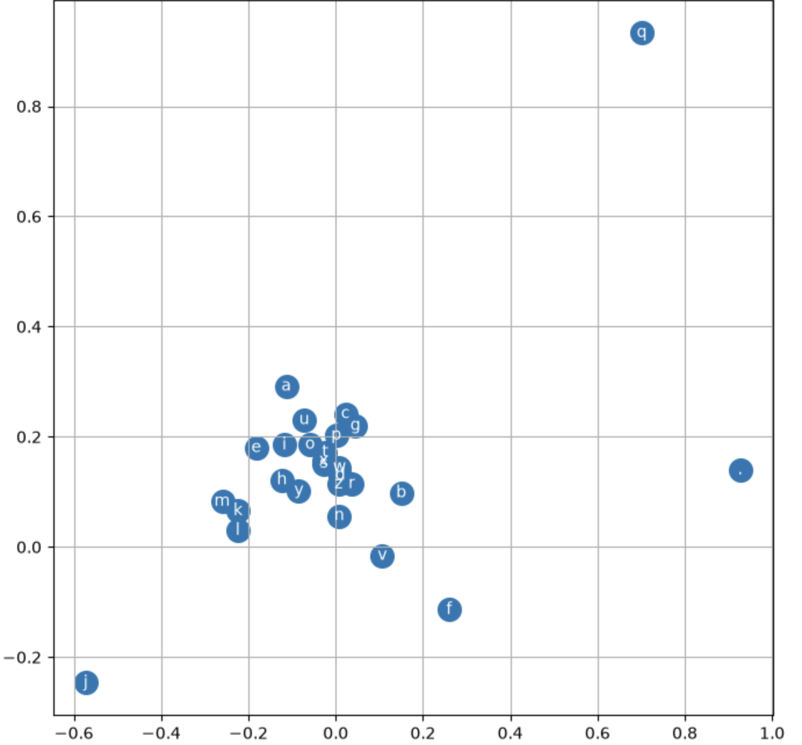

More information can be found by looking at the original [makemore](https://github.com/karpathy/makemore)

I did the first 3 parts of Makemore

Makemore is ment to make a name using a training data of ~32000 names contained in [names.txt](names.txt)

---

### [part 1](makemore.ipynb) a bigram character-level language model:

A character level language model will generate the next character of the name using previously generated characters.

In Makemore the training data needs to be changed before it can be used.
Each name is split into individual pairs of characters. There is a symbol added to the beginning and end of each word as well, this is done with this code.
An example of this is for `'emma'` it would become:
```
<S>e
em
mm
ma
a<E>
```

This code will do this for the whole dataset and count how many times each bigram will appear:
```python
b = {}
for w in words:
    chs = ['<S>'] + list(w) + ['<E>']
    for ch1, ch2 in zip(chs, chs[1:]):
        bigram = (ch1, ch2)
        b[bigram] = b.get(bigram, 0) + 1
```

PyTorch can represent and manipulate this data in a 2d array. This code would do this:

```python
import torch
# create a 27x27 array of integers to represent all the characters.
N = torch.zeros((27, 27), dtype=torch.int32)

# create a sorted set of the unique characters in the training data.
chars = sorted(list(set(''.join(words))))

# create a map of string -> integer for each character.
stoi = {s:i+1 for i,s in enumerate(chars)}

# use `.` to represent beginning and end of each sequence.
stoi['.'] = 0

# create the reverse look up.
itos = {i:s for s,i in stoi.items()}

# populate N with two-dimensional mapping of bigrams as integers (ch1/ch2) -> count.
for w in words:
    chs = ['.'] + list(w) + ['.']
    for ch1, ch2 in zip(chs, chs[1:]):
        ix1 = stoi[ch1]
        ix2 = stoi[ch2]
        N[ix1, ix2] += 1
```
When displayed it would look like this:



With these counts the probability of each letter coming after another can be calculated then used in a simple model to predict names:

```python
# prepare a matrix of probabilities
P = (N+1).float()
P /= P.sum(1, keepdims=True) # keepdims=True – important to maintain the dimensions of the matrix.

# using a seeded generator with torch.multinomial (below) to make it deterministic
g = torch.Generator().manual_seed(2147483647)

for i in range(5):
  
    out = []
    ix = 0
    while True:
        p = P[ix]
        
        # use torch.multinomial to take a sample
        ix = torch.multinomial(p, num_samples=1, replacement=True, generator=g).item()
        
        out.append(itos[ix])
        if ix == 0:
            break
    print(''.join(out))
```
This will give:


```
mor.
axx.
minaymoryles.
kondlaisah.
anchshizarie.
```
These are not names but they are vaguely name-like this is due to the issues with a bigram model as it only looks at the previous character.
This results in names like mor as it is common for `m` to start a name and an `m` to be followed by a `o` and a `o` to be followed by an `r` and for an `r` to end the word.
So the bigram says it is a name despite it not being a name.

For this model a negative log likelihood is used to find the lost.

In the program it is done like this:

```python

log_likelihood = 0.0
n = 0

for w in words:
    chs = ['.'] + list(w) + ['.']
    for ch1, ch2 in zip(chs, chs[1:]):
        ix1 = stoi[ch1]
        ix2 = stoi[ch2]
        prob = P[ix1, ix2]
        logprob = torch.log(prob)
        log_likelihood += logprob
        n += 1
        #print(f'{ch1}{ch2}: {prob:.4f} {logprob:.4f}')

print(f'{log_likelihood=}')
nll = -log_likelihood
print(f'{nll=}')
print(f'{nll/n}')
```

For the whole dataset this gives a loss of 2.4543561935424805.


At the moment if there is a pair of characters that appears 0 time the loss is infinite so for example the name `andrejq` would give infinite loss as `jq` appears 0 times.
To fix this the counts are all increased by one so there are no bigrams with a probability of 0.
This does that: `P = (N+1).float()`

The limitation of this method is that when it is used for more than a bigram it grows exponentially. A bigram has 27^2 possibilities but a trigram has 27^3 and a ten-gram has 27^10 possible character set,
but the training data doesn't grow meaning that the number of time each character set occurs become close to or 0 make it meaningless this is called the curse of dimensionality – Bengio et al. (2003).
This can be fixed with a neural network **

Before, every bigram has been mapped to an integer this can't be used for a neural network so the integers need to be converted into vectors this is done with one hot encoding.

One-hot encoding has all possible value as floating value within a column that are always 1.0 or 0.0 so every column represent one value.

For example, if you only have a value that is A-C A would be 1 0 0 and B would be 0 1 0 and C would be 0 0 1.

As there are 27 characters it would have 27 columns.

This makes it a valid input to a neural network as it has a value for every input neuron.

The bigrams are stored as two values `xs` and `ys` where each is a character in the bigram and when the program runs the `xs` would be the input and the `ys` would be the output.

This is the code to do that:

```python
xs, ys = [], []
for w in words:
    chs = ['.'] + list(w) + ['.']
    for ch1, ch2 in zip(chs, chs[1:]):
        ix1 = stoi[ch1]
        ix2 = stoi[ch2]
        xs.append(ix1)
        ys.append(ix2)
xs = torch.tensor(xs)
ys = torch.tensor(ys)
num = xs.nelement()
print('number of examples: ', num)
```

The network is initialized with random weights and values made with `torch.randn` and it is based on a random distribution.

The training data can be used to apply gradient descent the `.backward()` from PyTorch is used:

```python
import torch.nn.functional as F

for k in range(1000):
  
    # forward pass
    xenc = F.one_hot(xs, num_classes=27).float() # input to the network: one-hot encoding
    logits = xenc @ W # predict log-counts
    counts = logits.exp() # counts, equivalent to N
    probs = counts / counts.sum(1, keepdims=True) # probabilities for next character
    loss = -probs[torch.arange(num), ys].log().mean() + 0.01*(W**2).mean()
    print(loss.item())
  
    # backward pass
    W.grad = None # set to zero the gradient
    loss.backward()
  
    # update
    W.data += -50 * W.grad
 ```

here `+ 0.01*(W**2).mean()` for model smoothing by pushing the weights towards zero and a uniform distribution. **

Now sample can be taken from the neural network
```python
g = torch.Generator().manual_seed(2147483647)

for i in range(5):
    out = []
    ix = 0
    while True:
    
        # ----------
        # BEFORE:
        #p = P[ix]
        # ----------
        # NOW:
        xenc = F.one_hot(torch.tensor([ix]), num_classes=27).float()
        logits = xenc @ W # predict log-counts
        counts = logits.exp() # counts, equivalent to N
        p = counts / counts.sum(1, keepdims=True) # probabilities for next character
        # ----------
        
        ix = torch.multinomial(p, num_samples=1, replacement=True, generator=g).item()
        out.append(itos[ix])
        if ix == 0:
            break
    print(''.join(out))
```
This gives
```
mor.
axx.
minaymoryles.
kondlaisah.
anchthizarie.
```
This is very similar to the original model but the advantage of this is as it is taken from the neural network it is more flexible meaning it can be expanded easily, both as it could be used for more than just bigrams and as more layers can be added. 

---

### [part 2](makemore2.ipynb) MLP:

This part a context length of 3 is used instead of a context length of 1

Part 2 of makemore uses the same training data as in part 1 ([names.txt](names.txt)).

Some libraries need to be imported as well:
```python
import torch
import torch.nn.functional as F
import matplotlib.pyplot as plt # for making figures
%matplotlib inline

# read in all the words
words = open('names.txt', 'r').read().splitlines()
```

The dataset also needs to be built and also the characters need to be assigned to integers:

```python
# build the vocabulary of characters and mappings to/from integers
chars = sorted(list(set(''.join(words))))
stoi = {s:i+1 for i,s in enumerate(chars)}
stoi['.'] = 0
itos = {i:s for s,i in stoi.items()} # integers representing 27 characters – 26 letters plus '.'

# build the dataset
block_size = 3 # context length: how many characters do we take to predict the next one?
X, Y = [], [] # X for the current context, Y for expected output (labels). Xs predict Ys.
for w in words:
  
    context = [0] * block_size
    for ch in w + '.':
        ix = stoi[ch]
        X.append(context)
        Y.append(ix)
        context = context[1:] + [ix] # crop and append
  
X = torch.tensor(X)
Y = torch.tensor(Y)
```

The context length is 3 there for it is padded with `.` before the first character
This would make the first name become:
```
... ---> e
..e ---> m
.em ---> m
emm ---> a
mma ---> .
```

Embeddings are created in a 27 by 2 (row table for every character) these are initialised randomly at first but the value will be changed through training.
```python
C = torch.randn((27, 2))
emb = C[X]
```

In X for every row, all of the characters in the context length are represented as an integer.
This means that X has a shape of `[228146, 3]` so there are 228146 examples.
By indexing C with X every character of X maps to a two column vector (row) of C.
`emb` becomes a table of character embeddings for every example in the data, with the shape `[228146, 3, 2]`.

Despite being a different process it does the same as the one hot encoding used in part 1 of makemore.
```python
  xenc = F.one_hot(xs, num_classes=27).float() # input to the network: one-hot encoding
  logits = xenc @ W # predict log-counts
```

The embeddings `emb` are a lookup table identical to `xenc @ W` seen in lecture 2, but more efficient.
For every value in X the table indexes its embedding.

In the neural network the hidden layer has its weights and biases initialised randomly, there are 6 inputs as there are the three characters and each character is mapped to two vectors.
```python
W1 = torch.randn((6, 100))
b1 = torch.randn(100)

h = torch.tanh(emb.view(-1, 6) @ W1 + b1)
```
The first layer outputs the embedding as 3 sets of 2, this can't be input into the hidden layer so it must be combined into 6 separate inputs.

The easiest way to do this in PyTorch is `emb.view(-1, 6)`, as this doesn't create new tensors. 
The number of columns is specified as `6`, but the number of rows is `-1`.
This allows PyTorch to infer the number of rows so it doesn't hard code the number of rows.

Tanh is then applied to make sure it is between -1 and 1


For the output layer, weights and biases are also initialised randomly and then applied to the output of the previous layer, producing logits. Then logits are exponentiated to give an equivalent of counts, like in makemore part 1, from which the probabilities and then loss are calculated.
This code will do that:
```python
W2 = torch.randn((100, 27))
b2 = torch.randn(27)

logits = h @ W2 + b2

counts = logits.exp()
prob = counts / counts.sum(1, keepdims=True)
loss = -prob[torch.arange(X.shape[0]), Y].log().mean()
```

This uses a manual softmax, this can be done more efficiently by replacing the last three lines with `loss = F.cross_entropy(logits, Y)`.
This makes both the forward and backward pass more efficient and the operation is more numerically well behaved.

For large values of logits `logits.exp()` will overflow so it outputs `inf` (infinity), the `inf` will be divided by `inf` which returns `nan` and destroys the loss.

` F.cross_entropy()` handles this by subtracts the largest value from all values so the largest becomes `0` and  all others become negative numbers.
Large negative numbers will become `0` not `inf` which can't destroy the loss.

If a network is too large, it can learn the training data not the patterns in it.
This means that it will perform well on the training data but bad on anything else, this is called overfitting.

If a network is too simple it can't learn the patterns.
This means that it will perform badly, this is called underfitting.

There are many optimisations for a network, to identify these creating the module can be split into three phases: training, development, and testing.

The data is normally split 80% training, 10% development and 10% testing.

Training is the iterative loop over the forward and backward pass that changes the parameters to reduce the loss.

In development, hyperparameters are changed manually. These are things like learning rate, batch size and number of layers, number of neurons in each layer etc.

Testing should be done sparingly so that you don't specialise the network for the testing data.

It is slow and inefficient to use the whole dataset for every training example (as talked about before with stochastic gradient descent) so instead batches are used.
This will only give an approximate gradient so it will not take the most direct path to reduce the loss, but overall it will improve faster than using all the training data.
To make these subsets, 32 random integers can be generated in order to index into X and Y.
This code will do that:

```python
# minibatch construct
ix = torch.randint(0, X.shape[0], (32,))
```

The learning rate is how much the network changes per step.


Putting everything together, this is what is made:

```python
# build the dataset
block_size = 3 # context length: how many characters do we take to predict the next one?

def build_dataset(words):  
    X, Y = [], []
    for w in words:

        #print(w)
        context = [0] * block_size
        for ch in w + '.':
            ix = stoi[ch]
            X.append(context)
            Y.append(ix)
            #print(''.join(itos[i] for i in context), '--->', itos[ix])
            context = context[1:] + [ix] # crop and append

    X = torch.tensor(X)
    Y = torch.tensor(Y)
    print(X.shape, Y.shape)
    return X, Y

# create training, dev, test splits
import random
random.seed(42)
random.shuffle(words)    # shuffle the words
n1 = int(0.8*len(words)) # 80% of the words
n2 = int(0.9*len(words)) # 90% of the words

Xtr, Ytr = build_dataset(words[:n1])     # use 80% for training
Xdev, Ydev = build_dataset(words[n1:n2]) # use n1 - n2 for dev (10%)
Xte, Yte = build_dataset(words[n2:])     # use the remaining 10% for test

# initialise the network
g = torch.Generator().manual_seed(2147483647) # for reproducibility
C = torch.randn((27, 2), generator=g)
W1 = torch.randn((6, 100), generator=g)
b1 = torch.randn(100, generator=g)
W2 = torch.randn((100, 27), generator=g)
b2 = torch.randn(27, generator=g)
parameters = [C, W1, b1, W2, b2]

for p in parameters:
    p.requires_grad = True

# begin training
for i in range(200000):
  
    # minibatch construct
    ix = torch.randint(0, Xtr.shape[0], (32,))
  
    # forward pass
    emb = C[Xtr[ix]]
    h = torch.tanh(emb.view(-1, 6) @ W1 + b1)
    logits = h @ W2 + b2
    loss = F.cross_entropy(logits, Ytr[ix])
    #print(loss.item())
  
    # backward pass
    for p in parameters:
        p.grad = None
    loss.backward()
  
    # update parameters and learning rate
    lr = 0.1 if i < 100000 else 0.01
    for p in parameters:
        p.data += -lr * p.grad

# evaluate the loss on the training set
emb = C[Xtr]
h = torch.tanh(emb.view(-1, 6) @ W1 + b1)
logits = h @ W2 + b2
loss = F.cross_entropy(logits, Ytr)
# loss of 2.3313


# evaluate the loss on the dev set
emb = C[Xdev]
h = torch.tanh(emb.view(-1, 6) @ W1 + b1)
logits = h @ W2 + b2
loss = F.cross_entropy(logits, Ydev)
# loss of 2.3318
```

The training and dev datasets have similar loss so it may be underfitting.

You would want to adjust hyperparameters (number of layers, batch size, learning rate, the size of the embeddings etc) to make it more optimised.

For this, increasing the dimension of the embeddings from 2 to 10 seemed to help and increasing the number of hidden layers did very little.

When the dev and training set loss starts to diverge, this means that the network is starting to overfit so the test data should be used to evaluate the model.

The embedding can be visualised as it is only two dimensional.

```python
plt.figure(figsize=(8,8))
plt.scatter(C[:,0].data, C[:,1].data, s=200)
for i in range(C.shape[0]):
    plt.text(C[i,0].item(), C[i,1].item(), itos[i], ha="center", va="center", color='white')
plt.grid('minor')
```



In the embedding table you can see how the network works, as similar characters are close together, like the vowels, as they are fairly interchangeable, and some are more isolated, like `q`, `.` and `j`

Now samples can be taken from the neural network:
```python
# sample from the model
g = torch.Generator().manual_seed(2147483647 + 10)

for _ in range(20):
    
    out = []
    context = [0] * block_size # initialize with all ...
    while True:
        emb = C[torch.tensor([context])] # (1,block_size,d)
        h = torch.tanh(emb.view(1, -1) @ W1 + b1)
        logits = h @ W2 + b2
        probs = F.softmax(logits, dim=1)
        ix = torch.multinomial(probs, num_samples=1, generator=g).item()
        context = context[1:] + [ix]
        out.append(ix)
        if ix == 0:
            break
    
    print(''.join(itos[i] for i in out))
```

This is notably better than the bigram model.

Example outputs:
```
carmah.
aabylle.
hiim.
shree.
cassanden.
jazheen.
deliah.
jareei.
nellaiah.
maiir.
kaleigh.
ham.
join.
quinn.
shoilea.
jadii.
wazelo.
dearynix.
kaellinslee.
dae.
```

### [part 3](makemore3(by_andrej_karpathy).ipynb) inproved (MLP) character-level language model:

For part 3 the same data is used again ([names.txt](names.txt)) and it starts with code functionally the same as makemore part 2 with some optimisations.

At initialisation the loss is `27.8817` but if there was an even distribution over every letter, as would be expected the loss would only be `3.2958`.
To make the initialisation better the value for the weight and logits need to be less extreme.
The first change to improve this is by multiplying `b2` by `0`.

The other change is to reduce `W2` by multiplying it by, say `0.01`, it can be any small number. 
Although it could be set to 0 which would make it so the loss starts at the expected value,
but if 0 is used it can lead to the network always having every neuron in that layer be the same.

By making the values less extreme at initialisation, the first iterations are not just spent reducing the values,
so more iterations are spent actually improving the network so in the same number of iterations you can have a better network.


Another issue at initialisation is that the value of `h` will often be `1` or `-1` due to how the tanh function works.
As most values become `1` or `-1`, the gradient is killed in the backward pass when going though tanh.
If this happens for every example in the training set, it becomes a dead neuron, as it will not change.

To fix this the values that are passed into the tanh need to be reduced.
The values passed into the tanh are calculated as `embcat @ W1 + b1`, so by reducing the weight and bias it will improve, so `b1` is multiplied by `0.01` and `W1` is multiplied by `(5/3) /  ((n_embd * block_size)**0.5)`. The equation is as such that the standard deviation will start at one after multiplying by `W1`.

For this network these did not make too big of a difference but on a deeper network it may result in there being no changes at all made to the network if the initialisation is bad enough.


Another important optimisation is adding batch normalisation.

The values that are passed into tanh you want to be Gaussian  (following a standard distribution).
Batch normalisation just makes the input to the tanh Gaussian.
This is done by subtracting the mean of `hpreact` (which is passed into tanh) then dividing it by the standard deviation of `hpreact` this can be done with this:
```python
bnmeani = hpreact.mean(0, keepdim=True)
bnstdi = hpreact.std(0, keepdim=True)
hpreact = bngain * (hpreact - bnmeani) / bnstdi + bnbias
with torch.no_grad():
    bnmean_running = 0.999 * bnmean_running + 0.001 * bnmeani
    bnstd_running = 0.999 * bnstd_running + 0.001 * bnstdi
```
There are additional variables used to allow the network to adjust the batch normalisation, as it only needs to be Gaussian at initialisation.

This fixes the tanh-saturation problem, as the values will mostly be small so that they don't end up being `1` or `-1`.

This also makes `b1` useless so it is removed.

At the moment it is not too important as, there is only one hidden layer, but with a bigger network batch normalisation will have a big effect.

Batch normalisation has a some issues that would make it undesirable but it is so effective at stabilising training that it's still used in most modern deep networks.
There are other normalisation techniques (e.g. Layer Normalisation, Group Normalisation, and Instance Normalisation) that are meant to prevent the issues with batch normalisation.

The second part of the code is functionally the same as the first, apart from some changes.
For example it has more layers, but it is also programmed differently.
It is programmed to make it less reliant on specific values, for example the equation for initialisation of the weight  `0.2` can be used instead of `5/3`, and it doesn't have that big of an effect, but that would have a substantial effect on the first section.

It also use less PyTorch and instead does the same thing that PyTorch would do but it is written out manually.
This is done to give a better understanding of how it works,. it doesn't inprove the program.
In end  the losses and the gradients are being very similar for both.

The code is also split into reusable classes (e.g. Linear, BatchNorm1d, Tanh) these are alike to PyTorch's own `nn.Module` API.
It also makes use of analytical graphs (these are an update-to-data ratio plot and two graphs show gradient distribution and activation distribution. These are similar to what was used to identify tanh-saturation problem earlier) to see how the network is performing.